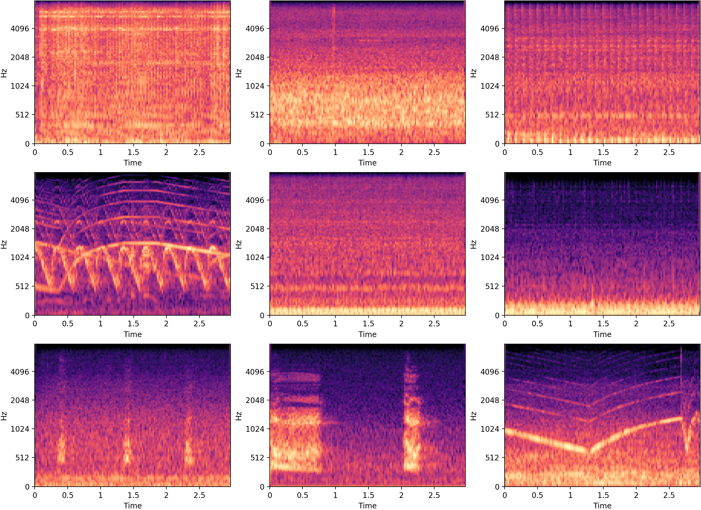
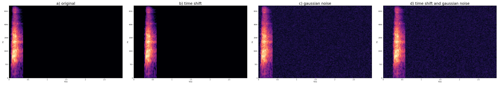
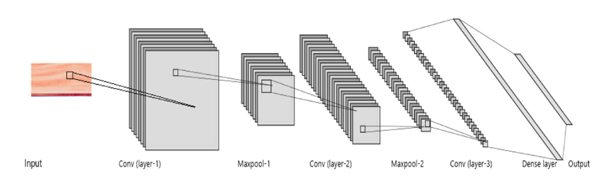
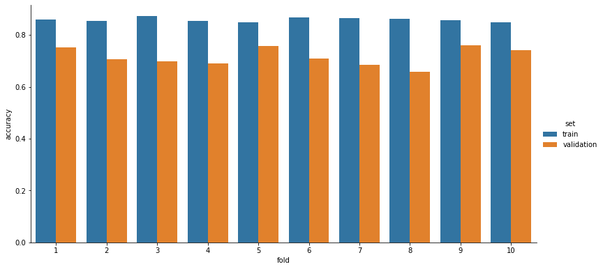
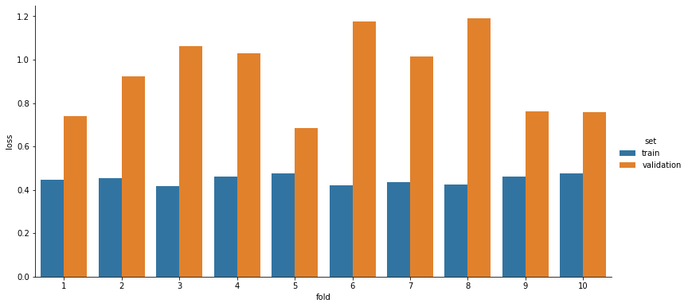

<h1> Environmental Sound Classification Using Deep Learning </h1>

The main idea of the project was to build a machine learning model that can classify multiple different environmental sound classes. For the identification of the environmental sounds, urban sound excerpts from the [UrbanSound8K](https://urbansounddataset.weebly.com/urbansound8k.html) dataset were selected, as well as a convolutional neural network model and two audio data augmentation techniques. 

Both PyTorch and Keras implementations of the model are provided in the project. Although the model performs slightly better with Keras, the primary focus of the project is on the PyTorch library, while the Keras implementation is provided only for the comparison of the obtained results. Therefore, the following sections will be focused solely on the development of a deep learning model for sound classification with PyTorch. 

In summary, the project provides a simple introduction to machine learning and sound classification, with the goal of exploring the PyTorch library and its functionalities. 

## Topics
* Data Preprocessing
* Digital Signal Processing (Log-Mel Spectrograms)
* Data Augmentation
* Convolutional Neural Networks
* Machine Learning
* Sound Classification
* K-Fold Cross Validation

## Technologies
* Python
* Librosa
* PyTorch, Keras
* NumPy, Pandas, Matplotlib, Seaborn
* Jupyter Notebook, Google Colab


## Dataset
* UrbanSound8K

<br>

Analysis of the results obtained with **10-fold cross-validation** is presented in the [Results](#results) section. The model achieves the accuracy of **72%** and the loss of **0.934** on the UrbanSound8K dataset with PyTorch. On the other hand, the model performs slightly better with Keras, achieving the accuracy of **75%** and the loss of **0.924**. More detailed results for the Keras implementation can be found in the [`evaluate_classifier_keras.ipynb`](notebooks/evaluate_classifier_keras.ipynb) notebook.

<h1> Table Of Contents </h1>

- [Project Description](#project-description)
- [UrbanSound8K](#urbansound8k)
- [Data Augmentation](#data-augmentation)
- [CNN Model](#cnn-model)
- [Implementation Details](#implementation-details)
- [Results](#results)
- [References](#references)

# Project Description

The project consists of three Jupyter Notebook files. The first contains the data preparation step and the other two contain the implementation of the sound classification model with PyTorch and Keras. Deep learning techniques applied in the classification of environmental sounds are specifically focused on the identification of the particular urban sounds from the UrbanSound8K dataset.

In the data preprocessing step, sounds from the dataset are converted to [log-mel spectrograms](https://towardsdatascience.com/getting-to-know-the-mel-spectrogram-31bca3e2d9d0). Spectrograms provide temporal and spectral characteristics of sound signals, and therefore can be used as image inputs in the training step. 

To increase the size of the training data, two data augmentation techniques are used. Both techniques are designed specifically for the augmentation of audio data, but applied as image augmentation techniques.

The model has a simple CNN architecture, composed of three convolutional layers and two dense layers. A more detailed description of the model's architecture can be seen in the [CNN model](#cnn-model) section.

The evaluation of the model is performed with the 10-fold cross-validation method on the predefined folds and with the accuracy metric.

# UrbanSound8K
"This dataset contains 8732 labeled sound excerpts (<=4s) of urban sounds from **10 classes**: 
1. air_conditioner,
2. car_horn, 
3. children_playing, 
4. dog_bark, 
5. drilling, 
6. enginge_idling, 
7. gun_shot, 
8. jackhammer, 
9. siren and 
10. street_music

All excerpts are taken from field recordings uploaded to [Freesound](https://freesound.org/). The files are pre-sorted into ten folds (folders named fold1-fold10) to help in the reproduction of and comparison with the automatic classification results reported in [this](http://www.justinsalamon.com/uploads/4/3/9/4/4394963/salamon_urbansound_acmmm14.pdf) article.

In addition to the sound excerpts, a CSV file containing metadata about each excerpt is also provided.

Audio files are in the WAV format and the sampling rate, bit depth, and number of channels are the same as those of the original file uploaded to Freesound (and hence may vary from file to file)." \[[4](#references)\]

<figure>
  <p align="center">
     <br>
    <b>Figure 1.</b> Examples of log-mel spectorgrams from the dataset.
  </p>
</figure>

# Data Augmentation

To compensate for the relatively small size of the dataset, two data augmentation techniques were used. Data augmentation was performed online by applying the techniques on the input spectrograms before they are fed to the model. Both techniques are applied with given probabilities, ensuring that the model is rarely trained on the exact same examples. Although this approach is much more time consuming, the effects of overfitting are significantly reduced.

The two main techniques used for the purposes of this project are:
* **Background Gaussian Noise**
  * Adds background white noise to the spectrogram.
* **Time Shifting**
  * Shifts the spectrogram to the right (in time) - a part of the spectrogram shifted out of the fixed length of the frame is cut off.

Considering that each technique is applied with a given probability, multiple different combinations of the same spectrogram input are possible when generating a new sample. An example of different possible combinations of data augmentation techniques used on the spectrogram of a dog barking sound is shown in **Figure 2.**

<figure>
  <p align="center">
     <br>
    <b>Figure 2.</b> Different combinations of data augmentation techniques used on a spectrogram from the dataset.
  </p>
</figure>


# CNN Model
The proposed CNN architecture is parameterized as follows:
* **1:** 24 filters with a receptive field of (5,5). This is followed by (3,3) strided max-pooling over the last two dimensions (time and frequency respectively) and a ReLU activation function.
* **2:** 36 filters with a receptive field of (4,4). Like layer-1, this is followed by (2,2) strided max-pooling and a ReLU activation function.
* **3**: 48 filters with a receptive field of (3,3). This is followed by a  ReLU activation function (no pooling).
* **4**: 60 hidden units, followed by a ReLU activation function and dropout layer.
* **5**: 10 output units, followed by a softmax activation function.

<figure>
  <p align="center">
     <br>
    <b>Figure 3.</b> Architecture of the CNN model [3].
  </p>
</figure>

# Implementation Details  
The code is organized into two Jupyter Notebook files:
1. [`data_preprocessing.ipynb`](notebooks/data_preprocessing.ipynb)
2. [`evaluate_classifier.ipynb`](notebooks/evaluate_classifier.ipynb)

<h2> 1. data_preprocessing.ipynb </h2>

The first notebook has two sections:
1. Download and extract the dataset file
2. Feature extraction

<br>

* The most important parts of the first notebook are shown in the next two code blocks. 
* The first code block contains a function that computes log-mel spectrograms from audio files. The computation of audio spectrograms is performed with the [Librosa](https://librosa.org/doc/latest/index.html) library and its functions for audio and music processing. Also, the length of the spectrogram is padded or cut off to the exactly 128 samples in the last part of the function.
* Each example from the dataset is processed so that its output spectrogram has a shape of (128,128), where the first dimension refers to the number of Mel bands and the second refers to the length of the spectrogram.

```python
def compute_melspectrogram_with_fixed_length(audio, sampling_rate, num_of_samples=128):
    try:
        # compute a mel-scaled spectrogram
        melspectrogram = librosa.feature.melspectrogram(y=audio, 
                                                        sr=sampling_rate, 
                                                        hop_length=HOP_LENGTH,
                                                        win_length=WINDOW_LENGTH, 
                                                        n_mels=N_MEL)

        # convert a power spectrogram to decibel units (log-mel spectrogram)
        melspectrogram_db = librosa.power_to_db(melspectrogram, ref=np.max)
        
        melspectrogram_length = melspectrogram_db.shape[1]
        
        # pad or fix the length of spectrogram 
        if melspectrogram_length != num_of_samples:
            melspectrogram_db = librosa.util.fix_length(melspectrogram_db, 
                                                        size=num_of_samples, 
                                                        axis=1, 
                                                        constant_values=(0, -80.0))
    except Exception as e:
        return None 
    
    return melspectrogram_db
```
* The second block shows the spectrogram feature extraction for each audio file from the dataset.

```python
SOUND_DURATION = 2.95   # fixed duration of audio excerpts in seconds

features = []

# iterate through all dataset examples and compute log-mel spectrograms
for index, row in tqdm(us8k_metadata_df.iterrows(), total=len(us8k_metadata_df)):
    file_path = f'{US8K_AUDIO_PATH}/fold{row["fold"]}/{row["slice_file_name"]}'
    audio, sample_rate = librosa.load(file_path, duration=SOUND_DURATION, res_type='kaiser_fast')
    
    melspectrogram = compute_melspectrogram_with_fixed_length(audio, sample_rate)
    label = row["classID"]
    fold = row["fold"]
    
    features.append([melspectrogram, label, fold])

# convert into a Pandas DataFrame 
us8k_df = pd.DataFrame(features, columns=["melspectrogram", "class", "fold"])
```
<h2> 2. evaluate_classifier.ipynb </h2>

The second notebook has six sections:
1. Create a custom Dataset class
2. Data augmentation
3. CNN model
4. Helper functions
5. 10-fold cross validation
6. Results

<br>

* The following two code blocks show the `__call__` method of two custom data augmentation classes used in the project.

```python
class MyRightShift(object):
    ...
    
    def __call__(self, image):
        if np.random.random() > self.shift_prob:
          return image

        # create a new array filled with the value of the min pixel
        shifted_image= np.full(self.input_size, np.min(image), dtype='float32')

        # randomly choose a start postion
        rand_position = np.random.randint(1, self.width_shift_range)

        # shift the image
        shifted_image[:,rand_position:] = copy.deepcopy(image[:,:-rand_position])

        return shifted_image
```
```python
class MyAddGaussNoise(object):
    ...
    
    def __call__(self, spectrogram):
      if np.random.random() > self.add_noise_prob:
          return spectrogram

      # set the std value 
      min_pixel_value = np.min(spectrogram)
      if self.std is None:
        std_factor = 0.03     # factor number 
        std = np.abs(min_pixel_value*std_factor)

      # generate a white noise spectrogram
      gauss_mask = np.random.normal(self.mean, 
                                    std, 
                                    size=self.input_size).astype('float32')
      
      # add white noise to the sound spectrogram
      noisy_spectrogram = spectrogram + gauss_mask

      return noisy_spectrogram
```
* The next three code blocks contain a few excerpts from the implementation of the CNN model with the PyTorch's [`torch.nn.Module`](https://pytorch.org/docs/stable/generated/torch.nn.Module.html) class. 
* The first block shows the initialization of the network's architecture in the `__init__` function and the second shows the model's `forward` function.
* The last block contains an excerpt from the model's `fit` function, which shows the implementation of the mini-batch training approach used in the project.
  
``` python
def __init__(self, device):
    super(Net, self).__init__()
    self.device = device

    self.conv1 = nn.Conv2d(in_channels=1, out_channels=24, kernel_size=5, padding=0)
    self.conv2 = nn.Conv2d(in_channels=24, out_channels=36, kernel_size=4, padding=0)
    self.conv3 = nn.Conv2d(in_channels=36, out_channels=48, kernel_size=3, padding=0)

    self.fc1 = nn.Linear(in_features=48, out_features=60)
    self.fc2 = nn.Linear(in_features=60, out_features=10)
```


```python
def forward(self, x):
    # cnn layer-1
    x = self.conv1(x)
    x = F.max_pool2d(x, kernel_size=(3,3), stride=3)
    x = F.relu(x)

    # cnn layer-2
    x = self.conv2(x)
    x = F.max_pool2d(x, kernel_size=(2,2), stride=2)
    x = F.relu(x)

    # cnn layer-3
    x = self.conv3(x)
    x = F.relu(x)

    # global average pooling 2D
    x = F.avg_pool2d(x, kernel_size=x.size()[2:])
    x = x.view(-1, 48)

    # dense layer-1
    x = self.fc1(x)
    x = F.relu(x)
    x = F.dropout(x, p=0.5)

    # dense output layer
    x = self.fc2(x)

    return x
```
```python
for epoch in range(epochs):
    self.train()

    for step, batch in enumerate(train_loader):
        X_batch = batch['spectrogram'].to(self.device)
        y_batch = batch['label'].to(self.device)
        
        # zero the parameter gradients
        self.optimizer.zero_grad()

        with torch.set_grad_enabled(True):
            # forward + backward 
            outputs = self.forward(X_batch)
            loss = self.criterion(outputs, y_batch)
            loss.backward()

            # update the parameters
            self.optimizer.step() 
``` 
* And lastly, the processing of a fold in the K-fold cross-validation method is performed with a helper function shown in the following code block. The function is designed specifically for the purposes of this project.

```python
def process_fold(fold_k, dataset_df, epochs=100, batch_size=32, num_of_workers=0):
    # split the data
    train_df = dataset_df[dataset_df['fold'] != fold_k]
    test_df = dataset_df[dataset_df['fold'] == fold_k]

    # normalize the data
    train_df, test_df = normalize_data(train_df, test_df)

    # init train data loader
    train_ds = UrbanSound8kDataset(train_df, transform=train_transforms)
    train_loader = DataLoader(train_ds, 
                              batch_size=batch_size,
                              shuffle=True,
                              pin_memory=True,
                              num_workers=num_of_workers)
    
    # init test data loader
    test_ds = UrbanSound8kDataset(test_df, transform=test_transforms)
    test_loader = DataLoader(test_ds, 
                             batch_size=batch_size,
                             shuffle=False,
                             pin_memory=True,
                             num_workers=num_of_workers)

    # init model
    model = init_model()

    # pre-training accuracy
    score = model.evaluate(test_loader)
    print("Pre-training accuracy: %.4f%%" % (100 * score[1]))
      
    # train the model
    start_time = datetime.now()
    history = model.fit(train_loader, epochs=epochs, val_loader=test_loader)
    end_time = datetime.now() - start_time
    print("\nTraining completed in time: {}".format(end_time))

    return history
```

* The other two helper functions in the project are `normalize_data` and `init_model`. The first normalizes the data in respect to the training data and the second initializes the model to a random initial state.
* The 10-fold cross-validation procedure is performed on the predefined folds. A more detailed explanation why it is important to do exactly the 10-fold cross-validation is given in the next section, and on [this](https://urbansounddataset.weebly.com/urbansound8k.html) site as well.
  
# Results
The model evaluation was performed with the 10-fold cross-validation method. As described in the [data paper](http://www.justinsalamon.com/uploads/4/3/9/4/4394963/salamon_urbansound_acmmm14.pdf), samples from the same class in the dataset are generally extracted from the same audio source files. Therefore, to avoid placing related samples in both the train and test sets, it is necessary to use the predefined folds. Otherwise, achieved results can end up being significantly inflated, leading to inaccurate scores that do not represent the model's performance on unseen data.

Loss and accuracy are metrics used for the evaluation. Categorical cross-entropy loss is selected for the loss function and the accuracy is defined as the percentage of correctly classified instances.

For each fold, the loss is calculated by taking the minimum loss value of all epochs on the validation set. Likewise, the accuracy for each fold is calculated by taking the best validation accuracy value over the epochs.

The results of the 10-fold cross-validation after repeating the procedure three times and calculating the mean are shown in **Table 1.** , **Figure 4.** and **Figure 5.** More detailed results can be found in the notebooks, including confusion matrices,  along with loss and accuracy graphs for each fold.


<b>Table 1.</b> Average loss and accuracy values for each fold over 3 cross-validation runs.
<center> 

|fold|accuracy| loss
|---|:-:|:-:|
|fold-1| 0.75|0.738|
|fold-2|0.71|0.925|
|fold-3|0.70|1.061|
|fold-4|0.69|1.030|
|fold-5|0.76|0.685|
|fold-6|0.71|1.177|
|fold-7|0.68|1.016|
|fold-8|0.66|1.190|
|fold-9|0.76|0.761|
|fold-10|0.74|0.760|
|**Total**|**0.72**|**0.934**| 
</center>

<figure>
  <p align="center">
     <br>
    <b>Figure 4.</b> Accuracy measured with the 10-fold cross-validation method.
  </p>
</figure>

<figure>
  <p align="center">
     <br>
    <b>Figure 5.</b> Loss measured with the 10-fold cross-validation method.
  </p>
</figure>

</br>

* **What's next?**
  * more in-depth analysis of the results
  * further tuning of the hyperparameters
  * testing the transfer learning approach
  * examining different data augmentation techniques, and modifying techniques specifically to particular sound classes
  * implementing a real-time sound classification system
  
<br>

# References

1. J. Salamon, C. Jacoby, and J.P.Bello, "A Dataset and Taxonomy for Urban Sound Research," in 22nd ACM International Conference on Multimedia (ACM-MM'14), Orlando, FL, USA, Nov. 2014, pp. 1041–1044. \[Online\]. Available: http://www.justinsalamon.com/uploads/4/3/9/4/4394963/salamon_urbansound_acmmm14.pdf 
2. J. Salamon and J. P. Bello, "Deep Convolutional Neural Networks and Data Augmentation for Environmental Sound Classification", submitted, 2016.\[Online\]. Available: https://arxiv.org/pdf/1608.04363.pdf
3. Zohaib Mushtaq, Shun-Feng Su, "Environmental sound classification using a regularized deep convolutional neural network with data augmentation", Applied Acoustics, Volume 167, 2020, 107389, ISSN 0003-682X, https://doi.org/10.1016/j.apacoust.2020.107389. (http://www.sciencedirect.com/science/article/pii/S0003682X2030493X)
4. J. Salamon, C. Jacoby and J. P. Bello, "UrbanSound8k Dataset", Urban Sound Datasets. Available: https://urbansounddataset.weebly.com/urbansound8k.html
